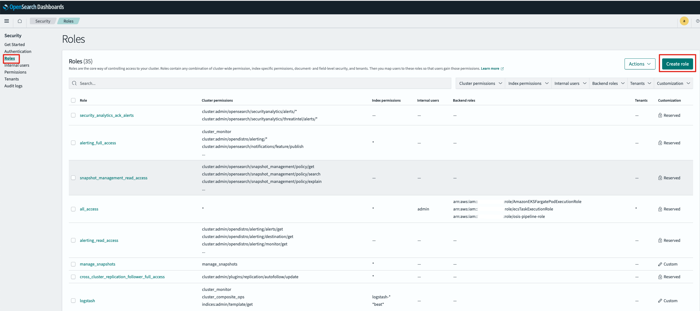
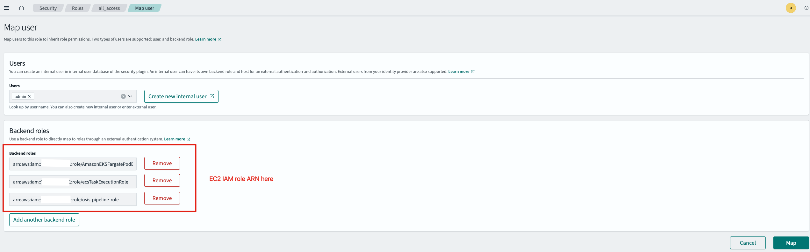

# Aurora Logs to S3 Tool

## Introduction

Aurora Logs to S3 Tool is a Python script designed to automatically download Amazon Aurora database logs and upload them to an S3 bucket. This tool supports multiple Aurora instances and features incremental upload functionality, effectively avoiding redundant downloads and uploads of previously processed log files.

## Features

- Support for multiple Aurora database instances
- Automatic download of logs from the specified number of recent days (default: 7 days)
- Upload logs to a specified S3 bucket
- Intelligent handling of active log files (current day logs) and historical log files
- Incremental upload functionality to avoid reprocessing previously uploaded historical log files
- Upload records stored in S3, ensuring upload status can be recovered even if local records are lost

## Requirements

- Python 3.6+
- AWS SDK for Python (Boto3)
- AWS credentials with access to Aurora instances and S3 buckets

## Installation

1. Clone or download this repository to your local machine

2. Install required dependencies:

```bash
pip install boto3
```
3. Configure AWS credentials:
- Use AWS CLI to configure AWS credentials, or manually create a file named ~/.aws/credentials and add the following content:
```ini
[default]
aws_access_key_id = YOUR_ACCESS_KEY_ID
aws_secret_access_key = YOUR_SECRET_ACCESS_KEY
 ```

## Configuration
- The config.ini file contains the tool's configuration information, including Aurora instance IDs, S3 bucket name, etc.
- The uploaded_records.json file is used to record information about uploaded log files to avoid duplicate processing.
- The log directory is used to store log files.
```plaintext
[aws]
region_name = us-east-1
s3_bucket_name = your-s3-bucket-name

[instances]
db_instance_identifiers = 
    instance-id-1
    instance-id-2
    instance-id-3
 ```

Configuration parameters:

- region_name: AWS region name
- s3_bucket_name: S3 bucket name for storing logs
- db_instance_identifiers: List of Aurora instance IDs, one per line
## Usage
1. Run the script:
```bash
python aurora_logs_to_s3.py
 ```

2. The script will automatically download Aurora instance log files and upload them to the specified S3 bucket.
3. Log files will be stored categorized by instance ID and date.
4. Upload records will be saved in the uploaded_records.json file to ensure incremental upload functionality.
5. It is recommended to set up a scheduled task to run the script periodically:
```bash
# Example: Run once every hour
0 * * * * cd /path/to/script && python aurora_logs_to_s3.py >> /path/to/logfile.log 2>&1
 ```
```

## How It Works
1. The script reads the configuration file to get AWS region, S3 bucket name, and Aurora instance ID list
2. For each Aurora instance:
   - Retrieve previous upload records from S3 (if they exist)
   - Get the list of log files for the instance
   - Download logs from the last 7 days (skip already uploaded non-current-day log files)
   - Upload log files to S3:
     - Current day active log files: overwrite on each upload
     - Historical log files: skip if already uploaded
   - Update upload records and save to S3
   - Clean up temporary files
## Log File Storage Structure
Log files are stored in S3 with the following path format:

```plaintext
s3://your-bucket-name/aurora-logs/instance-id/YYYY-MM-DD/log-filename
 ```

Upload record files are stored in S3 with the following path format:

```plaintext
s3://your-bucket-name/aurora-logs-records/instance-id_YYYY-MM-DD.json
 ```

## Troubleshooting
- If the script cannot connect to AWS services, check your AWS credentials and network connection
- If log files cannot be downloaded, ensure the IAM user/role has permission to access RDS service and related APIs
- If files cannot be uploaded to S3, ensure the IAM user/role has permission to access the S3 bucket
- Check the script's log output for detailed error information
## Required IAM Permissions
The script requires the following minimum IAM permissions to work properly:

```json
{
    "Version": "2012-10-17",
    "Statement": [
        {
            "Effect": "Allow",
            "Action": [
                "rds:DescribeDBLogFiles",
                "rds:DownloadDBLogFilePortion"
            ],
            "Resource": "arn:aws:rds:*:*:db:*"
        },
        {
            "Effect": "Allow",
            "Action": [
                "s3:PutObject",
                "s3:GetObject",
                "s3:ListBucket"
            ],
            "Resource": [
                "arn:aws:s3:::your-bucket-name",
                "arn:aws:s3:::your-bucket-name/*"
            ]
        }
    ]
}
 ```

Please replace your-bucket-name with your actual S3 bucket name.

## install Fluentbit
```bash
curl https://raw.githubusercontent.com/fluent/fluent-bit/master/install.sh | sh
 ```
### we need to create a IAM role for EC2 hosting fluentbit.
The IAM role should have the following permissions:
- AmazonS3FullAccess: This policy allows the role to read and write objects to S3 buckets.
- OpensearchServiceFullAccess: This policy allows the role to interact with Amazon OpenSearch Service.
1. Attach the role to your EC2 instance:
   
   - In the EC2 console, select your instance
   - Click "Actions" > "Security" > "Modify IAM role"
   - Select the role you just created from the dropdown list
   - Click "Save"
2. The EC2 instance will now use this role's permissions to access AWS resources without needing to configure access keys
### Mapping the EC2 role to Opensearch Service role.



3. configure fluentbit with the following configuration:
```
[SERVICE]
    Flush          5
    Daemon         Off
    Log_Level      trace
    log_file       /var/log/fluent-bit.log # remove this line when running in production

[INPUT]
    Name           tail
    Path           /home/ec2-user/aurora-logs/*/* 
    Tag            app.logs
    read_from_head        true

[FILTER]
    Name           aws
    Match          *
    private_ip     true
    imds_version   v2
    hostname       true
    ec2_instance_id    true

[OUTPUT]
    Name  s3
    Match *
    bucket                       {bucket-name} # replace with your bucket name
    region                       us-east-1
    total_file_size              250M
    s3_key_format                /aurora-logs/%Y/%m/%d/$UUID.gz
    s3_key_format_tag_delimiters .-
    compression                  gzip

[OUTPUT]
    Name  opensearch
    Match *
    AWS_Region us-east-1
    Host  vpc-ingestion-test-xxxxx.us-east-1.es.amazonaws.com # replace with your OpenSearch Service domain
    Port  443
    Path /
    AWS_Auth On
    TLS On
    Suppress_Type_Name On
    Index my_index22 # replace with your index name
```   

## License
MIT License

Copyright (c) 2023

Permission is hereby granted, free of charge, to any person obtaining a copy
of this software and associated documentation files (the "Software"), to deal
in the Software without restriction, including without limitation the rights
to use, copy, modify, merge, publish, distribute, sublicense, and/or sell
copies of the Software, and to permit persons to whom the Software is
furnished to do so, subject to the following conditions:

The above copyright notice and this permission notice shall be included in all
copies or substantial portions of the Software.

THE SOFTWARE IS PROVIDED "AS IS", WITHOUT WARRANTY OF ANY KIND, EXPRESS OR
IMPLIED, INCLUDING BUT NOT LIMITED TO THE WARRANTIES OF MERCHANTABILITY,
FITNESS FOR A PARTICULAR PURPOSE AND NONINFRINGEMENT. IN NO EVENT SHALL THE
AUTHORS OR COPYRIGHT HOLDERS BE LIABLE FOR ANY CLAIM, DAMAGES OR OTHER
LIABILITY, WHETHER IN AN ACTION OF CONTRACT, TORT OR OTHERWISE, ARISING FROM,
OUT OF OR IN CONNECTION WITH THE SOFTWARE OR THE USE OR OTHER DEALINGS IN THE
SOFTWARE.